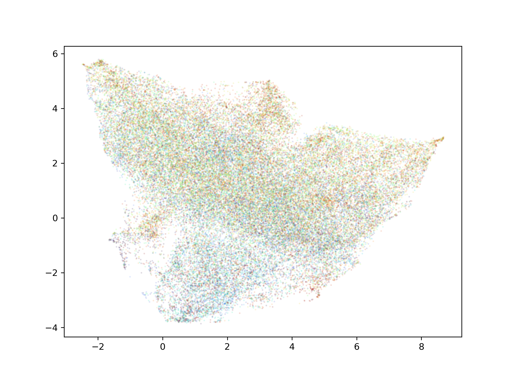
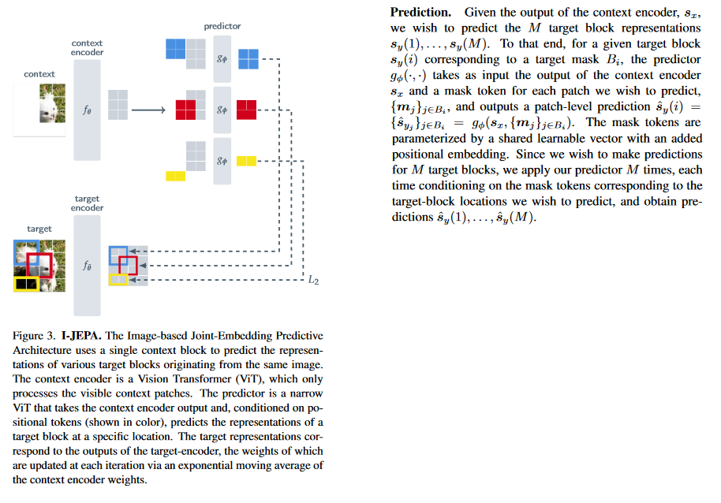

# JEPA
(Update 6/13/2023) Meta just released and open-sourced [their implementation of I-JEPA](https://github.com/facebookresearch/ijepa). A bittersweet moment for me!

This repository contains my experiments with Joint Embedding Predictive Architectures (JEPAs). It contains my barebones implementation of [I-JEPA (Image-JEPA)](https://arxiv.org/abs/2301.08243), which is this general architecture applied to the image domain. I've included a variant matching the paper, which uses a ViT and one that uses an energy transformer. 

I've also implemented a variant of my own I call the Saccade JEPA. It can either use a ViT or a more traditional neural network (Convnet, etc) as a backbone. It is essentially based on saccades in mammals: the eyes are constantly jittering and internally the brain predicts how this will affect the visual scene. This small augmentation (movement) and prediction task is a lot like a JEPA.

In particular, the Saccade JEPA features a few loss types:

* Prediction loss: Huber loss between an encoding of a target image and a prediction of it from a shifted (rotation + translation) version of it *with* an positional embedding that tells the predictor network the direction and rotation of the shift
* Cycle consistency loss: Shifting back to the original location should reproduce the original image representation, so this loss term ensures this does indeed happen
* VICReg loss: The invariance and covariance parts of the VICReg loss are implemented here.

Saccade JEPA is "plug-and-play" with different architectures. I use a ConvNext model as the teacher and student networks, with a MLP serving as the predictor.

## Getting started
The main libraries you will need are torch, torchvision, einops, and tqdm. Plotting (which is optional) uses matplotlib and UMAP. I will add a requirements or environment file soon but am holding off as things are still WIP. To run, use the jepa/train.py file.

If you want to use the EnergyJepa, you'll have to [my implementation of the energy transformer](https://github.com/LumenPallidium/energy_transformer) installed via pip (or you could just copy the main file from that repository to this repository's folders).

## What are JEPAs?

JEPAs are architectures that utilize self-superivsed learning in order to learn a semantically rich embedding of data. They are predictive in the sense that they are trained to predict the embedding of given portions of data from other embedded portions.

I-JEPA use a framework in which there are three networks: a context encoder, a target encoder, and a predictor. The target encoder is simply an exponentially moving average of the context encoder. The context encoder encodes large portions of an image (using a standard transformer framework, images are broken up into patches and each patch is given an embedding vector in some embedding space). The target encoder, on the other hand, encodes many small chunks of the same image, which are masked from the context portion of the image. The goal of the predictor is to predict these small embedded target chunks from the embedded context chunk. Both the predictor and context encoder are trained via backpropagation and gradient descent.

In this way, the model learns the structure of image, all while working in an embedding space. This is enabled by the fact that the predictor must learn to accurately predict. An advantage of this method compared with something like a (masked) autoencoder is that there is no limitation from a decoder. Not only does a decoder add more parameters to a model, it also adds a task which could in principle be harder than forming a strong representation of a given dataset's manifold (namely, the task of converting an object on that manifold to an object in a measurement space e.g. an image).

[Yann LeCun thinks hierarchical JEPAs may be the basis for a future AGI.](https://openreview.net/pdf?id=BZ5a1r-kVsf)

## Evaluating the Implementation

I ran the model on Imagenet for 21 epochs (with 1.2M images per epoch). Note that the paper trains for 300 epochs, but I can't do that on my single GPU in any reasonable amount of time :).

Due to the self-superivsed objective, it's hard to evaluate how the JEPA is learning with e.g. validation or test set loss. I used several methods to evaluate the model. Like the paper, one such method was linear probes and KNN to test a frozen version of the model on Imagenet classification accuracy. Ideally, the model forms semantically-rich representation that will enable linear probes and KNN to perform well on classification.

In addition to the metrics in the paper, I also looked into a few other metrics:

* Attention map visualization
* Correlation dimension
* UMAP embeddings colored by true image class (qualitative evaluation)

The attention map visualization is better depicted than explained:

https://github.com/LumenPallidium/jepa/assets/42820488/0abbf1fc-9ca1-4d9d-a935-7e6481ec95f2

The attention_vis.py file can be used to run this dashboard, it's implemented in dash. The visualization suggests that the model is learning semantic features, notice for example the figure/ground seperation. Attention head 7 in layer 5 also has the very interesting property that it seems to attend to what the patch is NOT a part of e.g. given a patch, it tends to attend to the surrounding objects as opposed to the selected one.

Correlation dimension is a measure frequently used in fractal analysis; given an object embedded in some N-d space, it aims to estimate the dimensionality of the object. Intuitively, it measures how the number of neighbors of a point grows as a function neighborhood radius. As an example, if you select points uniformly from 3D sphere embedded in a space of any dimension, the number of neighbors for any given point should grow as N^3.

Here is the UMAP of the embeddedings after training, very eagle-like:

## Implementation Notes

### Cropping/Masking
As an additional note, I'll describe how I intepreted some parts of the paper which I felt left some openness to intepretation (at this point I'm assuming you've looked through the paper). The following image shows a figure from the text describing the functioning of the I-JEPA along with a relevant section of text:

For the predictor, I assumed that the input was in the form of a concatenation of a masked target region and the encoded context. Positional information was naturally added via a predictor-specific learnable postional embedding, filtered to only given target and the context.

## Batch Masks
Initially, I used the same masks for every image in a batch. I think this led to some issues with gradients, as it to an eventual exponential increase in loss far on in training (which I noticed when I saw that small batches didn't have this issue to the same extent). To ameliorate this, I updated the model to vmap a non-batched forward step, so that I could have different size context and target masks (since different size tensors can't be stacked in general).

